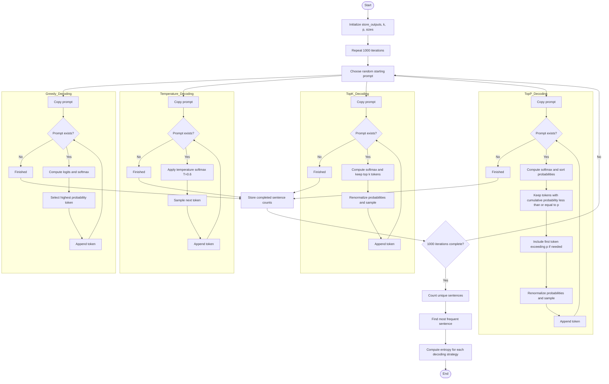
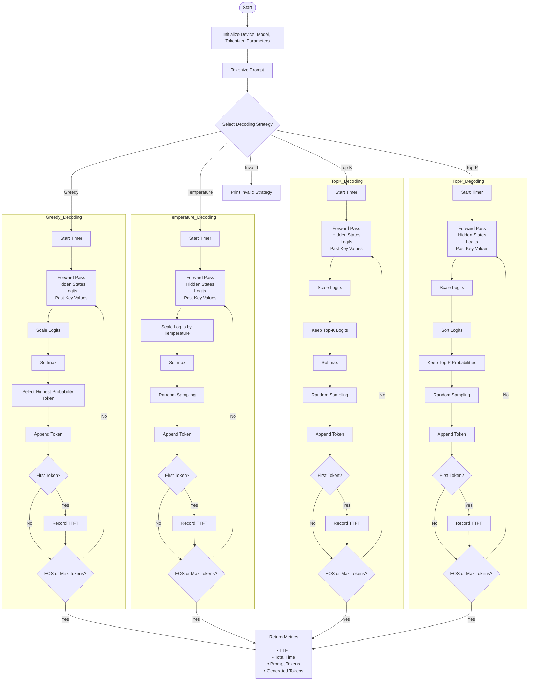

# Objective
To understand the implementation of the entire text generation pipeline after the token ids and the embeddings are computed.

---
# Models
1. Model - `Qwen/Qwen2.5-0.5B`
2. Tokenizer - `Qwen/Qwen2.5-0.5B`
3. Model for Causal LM - `Qwen/Qwen2.5-0.5B`

---
# Experiments
## Logits and Softmax
Create a fake logits dictionary with tokens and logit scores mapped to the tokens. Create a softmax function using numpy and use it on these fake logits to convert them to probabilities. Change few logits and observe how it affects the probability distribution.

## Decoding Strategies
1. **Temperature**
   - Create a temperature softmax function where probabilities varies with diffferent temperature. Use the json file - `fake_vocab.json`, which has fake tokens and logits to compute probabilities from this temperature softmax function. Create graph from this computed probabilities showing how the probability distribution varies with different temperature settings.

2. **Greedy**
   - Create a argmax function and use an array of random values to check if it returns the index of the maximum value in the array. Verify it by comparing it with built-in numpy or torch argmax function.
   - Autoregressive Generation: Use the json file `fake_transformer_1000.json` to simulate a fake transformer text generation. 
3. **Top-k**
   - Use the `fake_vocab.json` file to compute the top-10 probabilities and map it back to the token.
   - Autoregressive Generation: Simulate a fake transformer using the same `fake_transformer_1000.json` used in the greedy method.
4. **Top-p**
   - Try different probability threshold to observe the number of tokens selected, revealing the probability distribution.
   - Autoregressive Generation: Simulate a fake transformer using the same `fake_transformer_1000.json` used in the greedy method.

## AutoRegressive Generation Using Fake Tokens and Logits
Used `Qwen/Qwen2.5-0.5B` to create a AutoRegressive Generation of tokens with the help of `fake_ transformer_1000.json` file.

- Used 10 different starting words, k=3 and p=0.95.
- In each `for-loop`, all the different techniques receives the same starting prompt, and they ran inside a while loop until the end of sequence is reached. One `for-loop` is completed after all the decoding techniques reached end of sequence.
- This was simulated for a total of 1000 loops.
- Three different categories of results were produced: Unique Sentences, Most Frequent Senteces and Shannon's Capacity.
  
Note: The AutoRegressive Generation for all decoding technique is carried out in a single function, but seperate implementation is possible as well.
Here is the mermaid diagram of the AutoRegressive Generation:

## Real Inference
1. Load the `Qwem/Qwen2.5-0.5B`model, tokenizer and model for causal lm.
2. Build a real inference pipeline function using this model from the prompt tokenization to the continuos text generation, with all the decoding techniques.
3. Track the following metrics - total time, tokens/sec, prompt length and oenerated tokens for each complete execution.
4. Test the `greedy` decoding strategy with variable output token target and variable prompt lengths using the pipeline function. Run it on both CPU and GPU and obesrve the difference in the latency, token/sec.
5. Carry out two tests: `coding test` - to fact check the model response and `story test` - to test the creativeness of the model. Observe which pair of temperature and p produces the best results for each test. Use `Top-p` decoding technique with temperature for this test, i.e., test different pairs of p and temperature to test the response of the model.

Here is the mermaid diagram of the inference pipeline:

